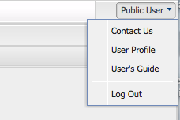

[Home](./index.md) > Quick Start

# Quick Start
### Your First Query
For this example we are going to query the NHANES i2b2/tranSMART resource to obtain the mean systolic pressure for all males. We will then download this data in CSV format so that we may analyze it later.

#### Obtaining your access key
* Go to [NHANES](https://nhanes.hms.harvard.edu) i2b2/tranSMART site
* Click the 'Public User' button and then the user profile button.



* Copy the BD2K PICSURE API Key


#### Starting a session
*GET https:/<span></span>/hanes.hms.harvard.edu/rest/v1/securityService/startSession?key=&lt;key&gt;*

Response
```JSON
{
  "status": "success"
}
```

#### Seeing the available resources
*GET https:/<span></span>/nhanes.hms.harvard.edu/rest/v1/resourceService/resources*

Response
```JSON
[
  {
    "id": 1,
    "name": "nhanes",
    "ontologyType": "TREE",
    "implementation": "i2b2/tranSMART",
    "relationships": [
      "PARENT",
      "CHILD",
      "SIBLING",
      "MODIFIER",
      "TERM"
    ],
    "logicaloperators": [
      "AND",
      "OR",
      "NOT"
    ],
    "predicates": [
      {
        "predicateName": "CONTAINS",
        "displayName": "Contains",
        "description": "Contains value",
        "default": true,
        "fields": [
          {
            "name": "By Encounter",
            "path": "ENOUNTER",
            "description": "By Encounter",
            "required": true,
            "dataTypes": [],
            "permittedValues": [
              "YES",
              "NO"
            ]
          }
        ],
        "dataTypes": [
          "STRING",
          "INTEGER",
          "FLOAT"
        ],
        "paths": []
      },
      {
        "predicateName": "CONSTRAIN_MODIFIER",
        "displayName": "Constrain by Modifier",
        "description": "Constrain by Modifier",
        "default": false,
        "fields": [
          {
            "name": "Modifier",
            "path": "MODIFIER_KEY",
            "description": "Constrain by a modifier of this entity",
            "required": true,
            "dataTypes": [],
            "permittedValues": [],
            "relationship": "MODIFIER"
          },
          {
            "name": "By Encounter",
            "path": "ENOUNTER",
            "description": "By Encounter",
            "required": true,
            "dataTypes": [],
            "permittedValues": [
              "YES",
              "NO"
            ]
          }
        ],
        "dataTypes": [
          "STRING",
          "INTEGER",
          "FLOAT"
        ],
        "paths": []
      },
      {
        "predicateName": "CONSTRAIN_VALUE",
        "displayName": "Constrain by Value",
        "description": "Constrains by Value",
        "default": false,
        "fields": [
          {
            "name": "Operator",
            "path": "OPERATOR",
            "description": "Operator",
            "required": true,
            "dataTypes": [],
            "permittedValues": [
              "EQ",
              "NE",
              "GT",
              "GE",
              "LT",
              "LE",
              "BETWEEN",
              "LIKE[exact]",
              "LIKE[begin]",
              "LIKE[end]",
              "LIKE[contains]"
            ]
          },
          {
            "name": "Constraint",
            "path": "CONSTRAINT",
            "description": "Constraint",
            "required": true,
            "dataTypes": [
              {
                "name": "string",
                "pattern": "^.*$",
                "description": "A string value"
              },
              {
                "name": "integer",
                "pattern": "^\\d+$",
                "description": "An integer value"
              },
              {
                "name": "float",
                "pattern": "^([+-]?\\d*\\.?\\d*)$",
                "description": "A float value"
              }
            ],
            "permittedValues": []
          },
          {
            "name": "Unit of Measure",
            "path": "UNIT_OF_MEASURE",
            "description": "Unit of Measure",
            "required": false,
            "dataTypes": [
              {
                "name": "string",
                "pattern": "^.*$",
                "description": "A string value"
              }
            ],
            "permittedValues": []
          },
          {
            "name": "By Encounter",
            "path": "ENOUNTER",
            "description": "By Encounter",
            "required": true,
            "dataTypes": [],
            "permittedValues": [
              "YES",
              "NO"
            ]
          }
        ],
        "dataTypes": [
          "STRING",
          "INTEGER",
          "FLOAT"
        ],
        "paths": []
      },
      {
        "predicateName": "CONSTRAIN_DATE",
        "displayName": "Constrain by Date",
        "description": "Constrains by Date",
        "default": false,
        "fields": [
          {
            "name": "From Inclusive",
            "path": "FROM_INCLUSIVE",
            "description": "Inclusive From Date",
            "required": true,
            "dataTypes": [],
            "permittedValues": [
              "YES",
              "NO"
            ]
          },
          {
            "name": "From Time",
            "path": "FROM_TIME",
            "description": "From Date Start or End",
            "required": true,
            "dataTypes": [],
            "permittedValues": [
              "START_DATE",
              "END_DATE"
            ]
          },
          {
            "name": "From Date",
            "path": "FROM_DATE",
            "description": "From Date",
            "required": true,
            "dataTypes": [
              {
                "name": "date",
                "pattern": "^\\d{4}\\-(0?[1-9]|1[012])\\-(0?[1-9]|[12][0-9]|3[01])$",
                "description": "Date in yyyy-mm-dd format",
                "typeof": "dateTime"
              }
            ],
            "permittedValues": []
          },
          {
            "name": "To Inclusive",
            "path": "TO_INCLUSIVE",
            "description": "Inclusive To Date",
            "required": true,
            "dataTypes": [],
            "permittedValues": [
              "YES",
              "NO"
            ]
          },
          {
            "name": "To Time",
            "path": "TO_TIME",
            "description": "To Date Start or End",
            "required": true,
            "dataTypes": [],
            "permittedValues": [
              "START_DATE",
              "END_DATE"
            ]
          },
          {
            "name": "To Date",
            "path": "TO_DATE",
            "description": "To Date",
            "required": true,
            "dataTypes": [
              {
                "name": "date",
                "pattern": "^\\d{4}\\-(0?[1-9]|1[012])\\-(0?[1-9]|[12][0-9]|3[01])$",
                "description": "Date in yyyy-mm-dd format",
                "typeof": "dateTime"
              }
            ],
            "permittedValues": []
          },
          {
            "name": "By Encounter",
            "path": "ENOUNTER",
            "description": "By Encounter",
            "required": true,
            "dataTypes": [],
            "permittedValues": [
              "YES",
              "NO"
            ]
          }
        ],
        "dataTypes": [],
        "paths": []
      }
    ],
    "selectOperations": [],
    "joins": [],
    "sorts": [],
    "processes": [],
    "visualization": [],
    "dataTypes": [
      {
        "name": "dateTime",
        "pattern": "^(\\d{4})-(\\d{2})-(\\d{2}) (\\d{2}):(\\d{2}):(\\d{2})$",
        "description": "Date in yyyy-mm-dd hh:mm:ss format. With hours in 24 hour format"
      },
      {
        "name": "date",
        "pattern": "^\\d{4}\\-(0?[1-9]|1[012])\\-(0?[1-9]|[12][0-9]|3[01])$",
        "description": "Date in yyyy-mm-dd format",
        "typeof": "dateTime"
      },
      {
        "name": "integer",
        "pattern": "^\\d+$",
        "description": "An integer value"
      },
      {
        "name": "string",
        "pattern": "^.*$",
        "description": "A string value"
      },
      {
        "name": "float",
        "pattern": "^([+-]?\\d*\\.?\\d*)$",
        "description": "A float value"
      }
    ]
  }
]
```

#### Running a query
*GET https:/<span></span>/nhanes.hms.harvard.edu/rest/v1/queryService/runQuery*

BODY
```JSON
{
	"select": [
	  {
		    "field": {
			    "pui": "/nhanes/Demo/examination/examination/blood pressure/mean systolic/",
			    "dataType": "STRING"
		    },
    		"alias": "Systolic Pressure"
	  }
	],
	"where": [
	  {
		    "field": {
			    "pui": "/nhanes/Demo/demographics/demographics/SEX/male",
    			"dataType": "STRING"
	    	},
		    "predicate": "CONTAINS",
		    "fields": {
			    "ENOUNTER": "YES"
		    }
	  }
	]
}
```

Response
```JSON
{
  "resultId": 169801
}
```

#### Checking on the status of a query

_GET https:/<span>/nhanes.hms.harvard.edu/</span>rest/v1/resultService/resultStatus/&lt;resultId&gt;_

Response
```JSON
{
  "resultId": 169801,
  "status": "AVAILABLE"
}
```


#### Getting the CSV results of a query
_GET https:/<span></span>/nhanes.hms.harvard.edu/rest/v1/resultService/result/&lt;resultId&gt;/CSV_

Response
```
PATIENT_NUM,Systolic Pressure
10997,136
10998,132.66667
22528,111.33333
23658,115.33333
22526,106.66667
34229,99.33333
22525,112.66667
34227,117.33333
10990,124
25795,118
34225,112.66667
25796,102
34226,120.66667
10993,125.33333
23651,109.33333
34224,113.33333
10996,143.33333
23653,138.66667
34222,102
25794,114
22518,109.33333
22515,114
34219,176
22517,128.66667
```

#### Ending a session
*GET https:/<span></span>/nhanes.hms.harvard.edu/rest/v1/securityService/endSession*

Response
```JSON
{
  "status": "success"
}
```
