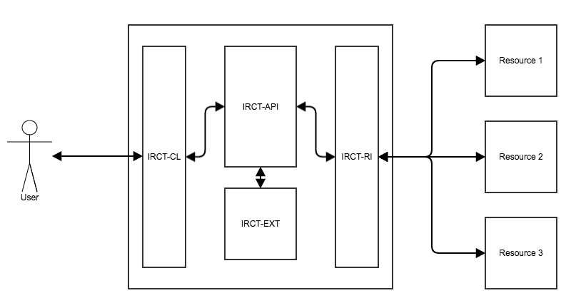

# User Guide

## Introduction
#### Purpose of this Document
This document will provide users with an understanding of how to interact with the Inter-Resource Communication Tool (IRCT). This includes an understanding of what the IRCT is, how to understand how to interact with resources it is connected to.

This document is broken into nine sections. The first section provides an overview
of the IRCT and dives into how a resource driven API, and individual components work.
We then provide a quick start where users can quickly write their first query against
the NHANES i2b2/tranSMART instance. We follow this up with an introduction into
security and interacting with secure resources. Then we explain more about resources,
and how users can understand what services, queries, and processes they support.
We follow this up by sections on searching for terms, writing queries, running processes,
and finally retrieving results in different formats. We wrap it all up with a section
on bringing it all together, how the IRCT can work for you, and some closing thoughts.

Since the IRCT is versioned we keep references to previous versions of the API in this document. Please check with your IRCT administrator to obtain your IRCT version.

###### Style Guide

Stle | Meaning
-----|--------
_Italic_ | Calls to the RESTFull Service
**Bold** | Important notes
`Monospace` | Code, sent or returned data

## IRCT
#### What is the IRCT?
One of the stated goals of the NIH Big Data to Knowledge (BD2K) initiative is to harvest the wealth of information contained in Big Data to advance our knowledge of human health and disease. As part of this initiative the Harvard University Medical School (HMS) Department of Biomedical Informatics Patient-Centered Informatics Common: Standard Unification of Research Elements (PIC-SURE) is developing an open-source infrastructure that will foster the incorporation of multiple heterogeneous patient level clinical, omic, and environmental datasets. This system embraces the idea of decentralized repositories (resources) of varying types, and protocols. It provides a single simple secure communication interface that can perform queries, joins, and computations across different resources. To implement this we created the BD2K PIC-SURE RESTfull API. Short acronym is IRCT (Inter Resource Communication Tool) which provides a resource agnostic service through which multiple resources of varying types, and protocols can be accessed. Users communicate with this service using a series of Representative State Transfer (RESTful) calls.

#### What can the IRCT do?
The easiest way to understand what the IRCT is by explaining what it isn’t. First and foremost it is not an attempt at a universal API. It is not going to be the one API, or protocol that all biomedical application should implement. It does not require existing resource to change their protocol. It does not define an ontology, or prefer one type of ontology over another. And it does not restrict the where, or how data is stored.

The core idea behind IRCT is that no API, protocol, ontology, or application is going to be a perfect fit for all biomedical research. However being able to combine data across different resources will provide a powerful tool for researches. The IRCT accomplishes this by allows different resources to be defined – by initial configuration -  what they are, what they have, and what they can do. It can support existing resources without requiring them to make any changes, and allows new resources to be quickly integrated. This is accomplished by creating a ‘Resource-Driven API’.

#### What is a Resource Driven API?
All actions that can be performed by resources from the IRCT are abstracted into a set of definitions. These definitions provide basic information such as what predicates are supported, and can be executed on the resource. Since the IRCT doesn’t restrict what actions, and commands can be performed individual resources can define any number of predicate operators, data types, parameters, and. This model is flexible enough to support several different resource types, but still rigid enough to allow users to quickly create and execute different actions with the IRCT

#### IRCT Components Overview


The IRCT consists of four components; Communication Layer (IRCT-CL), API (IRCT-API), Extensions (IRCT-EXT), and Resource Interfaces (IRCT-RI). Each component performs a specific task so that a query, or any other action can be accomplished.

## Quick Start
#### Your First Query
For this query we are going to query the NHANES i2b2/tranSMART resource to obtain the mean systolic, and mean diastolic pressure for all males who are over the age of 65. We want to have this data returned to us in CSV format so that we may analyze it later with another piece of software.

###### Obtaining your access key


###### Starting a session
*GET https://<span></span>nhanes.hms.harvard.edu/rest/v1/securityService/startSession?key=&lt;key&gt;*

Response
```JSON
{
  "status": "success"
}
```

###### Seeing the available resources
*GET https://<span></span>nhanes.hms.harvard.edu/rest/v1/resourceService/resources*
Response
```JSON
[

]
```

###### Running a query
*POST https://<span></span>nhanes.hms.harvard.edu/rest/v1/queryService/runQuery*

BODY
```JSON
{
	"select": [
	  {
		    "field": {
			    "pui": "/nhanes/Demo/examination/examination/blood pressure/mean systolic/",
			    "dataType": "STRING"
		    },
    		"alias": "Systolic Pressure"
	  },
      {
		    "field": {
			    "pui": "/nhanes/Demo/examination/examination/blood pressure/mean diastolic/",
			    "dataType": "STRING"
		    },
    		"alias": "Diastolic Pressure"
	  }
	],
	"where": [
	  {
		    "field": {
			    "pui": "/nhanes/Demo/demographics/demographics/SEX/male",
    			"dataType": "STRING"
	    	},
		    "predicate": "CONTAINS",
		    "fields": {
			    "ENOUNTER": "YES"
		    }
	  },
      {
        "field": {
          "pui": "/nhanes/Demo/demographics/demographics/AGE",
          "dataType": "STRING"
        },
        "predicate": "CONTAINS",
        "fields": {
          "ENOUNTER": "YES"
        }
      }
	]
}```

Response
```JSON
{
  "resultId": 158101
}
```

###### Checking on the status of a query

*GET https://<span></span>nhanes.hms.harvard.edu/rest/v1/resultService/resultStatus/&lt;resultId&gt;*

Response
```JSON
{
  "resultId": 158101,
  "status": "AVAILABLE"
}
```


##### Getting the CSV results of a query
*GET https://<span></span>nhanes.hms.harvard.edu/rest/v1/resultService/result/&lt;resultId&gt;/CSV*

Response
```JSON
{
  "status": "success"
}
```

###### Ending a session
_GET https://<span></span>nhanes.hms.harvard.edu/rest/v1/securityService/endSession_

Response
```CSV
PATIENT_NUM,Systolic Pressure
"",""

...
```

## Security
#### Overview

#### Obtaining Keys

#### Using Keys

## Resources
#### What are Resources?
Resources are

#### Getting a List of Resources

*GET /rest/v1/resourceService/resources*

Example Response
```JSON
```

#### Understanding Resources

## Term Search
#### Searching for a Term Across Resources
*GET /rest/v1/resourceService/find?term=&lt;TERM&gt;*

#### Searching for a Term on a Resource
*GET /rest/v1/resourceService/&lt;RESOURCE&gt;?term=&lt;TERM&gt;*

#### Using Search Extensions
*GET /rest/v1/resourceService/&lt;RESOURCE&gt;?term=&lt;TERM&gt;&&lt;PARAMETER&gt;=&lt;VALUE&gt;*

## Queries
#### What are Queries?
Queries are a simple way to retrieve data out of a resource.

In the IRCT they are resource agnostic, and are automatically translated to the native language of the resource.

#### How do I Write a Query?

#### Basic Queries

#### Nested Queries

#### Advanced Queries


## Processes
#### What are Processes?
#### How do I Write a Process?

## Results
#### Result Status
#### Result Retrieval

## Bringing it all together
